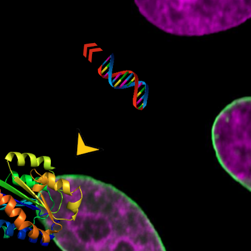
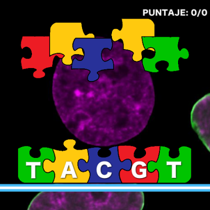
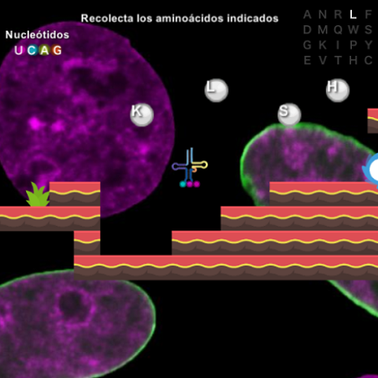

# El juego de la vida 

El juego de la vida es una aproximación interactiva y didáctica para aprener el ciclo de la creacion de proteínas a partir del ADN. El proyecto fue creado en el marco de la materia **Introducción a la Bioinformática** de la carrera Lic. en Informática, [Universidad de Quilmes](www.unq.edu.ar). El juego consta de tres niveles.

## Nivel 1

Se trata de representar el proceso de salida del ADN del núcleo y conexión con el ARN polimerasa. En este nivel el usuario se encuentra en primera persona siendo el ADN y debe "encontrar" el polimerasa. Con el fin de hacerlo mas entretenido, el ARN se moverá a lo largo del mapa y deberá seguirlo.

*Pista*: Hay una flecha cercana al ADN que indica en que dirección se encuentra el ARN polimerasa.

## Nivel 2

El nivel dos representa el proceso de transcripción. Con el fin de reproducir la relacion entre las bases nucleótidas y la hebra de ARN mensajero utilizamos piezas de rompecabezas, algunas estan sueltas y otras fijas a la hebra. La idea es unirlas de manera apropiada para asi poder transcribir el ADN entrante.

## Nivel 3

En el nivel tres, nos situamos en el ribosoma y el personaje principal es un ARN de transferencia. El objetivo es juntar los aminoácidos correctos para poder terminar de formar la proteína.
En la parte superior derecha de la pantalla se encuentran las letras correspondientes a los residuos, y en resaltada la que se debe capturar.

*Nota*: Es importante que se colecten los aminoácidos en el orden correcto, de no ser así, formarían una proteína diferente.

## Mucha suerte, y ¡A jugar!
## Colaboradores 
- [Nicolas Alvarez](github.com/nicolas-alv3)
- [Esteban Cicovich](github.com/eacico)
- [Juan Hualampa](github.com/juanhualampa)
- [Luis Coronel](github.com/luchist)